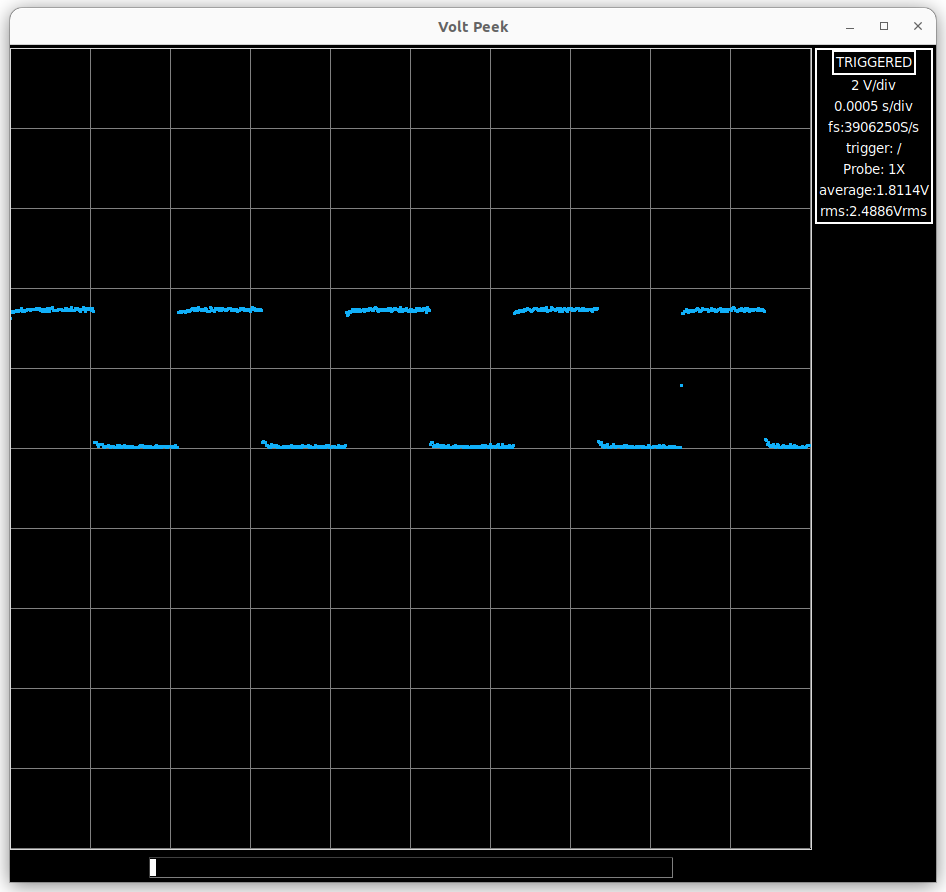
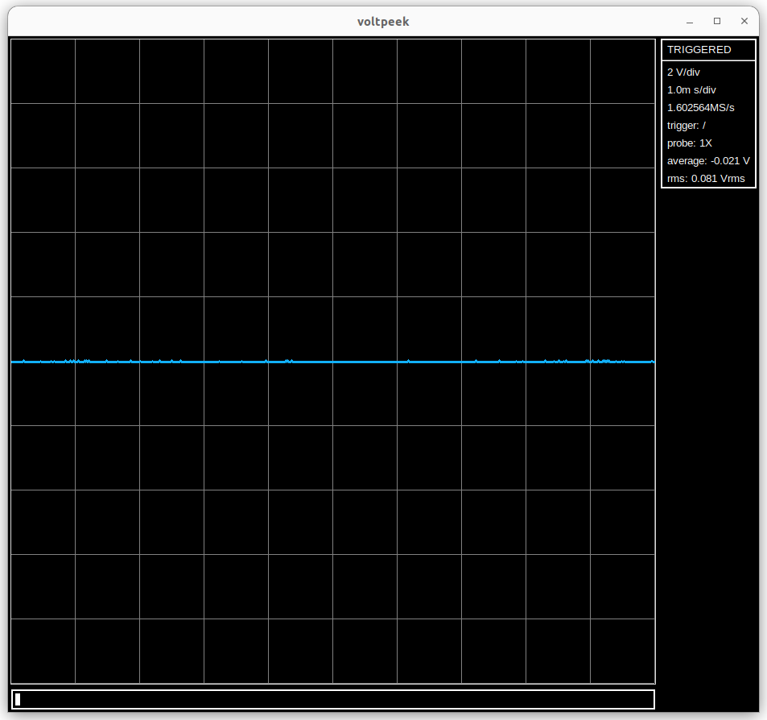

## Voltpeek
Voltpeek is a command based PC oscilloscope software. Voltpeek works
with the NS1 headless oscilloscope [hardware](https://hackaday.io/project/197104-ns1-oscilloscope) and [firmware](https://github.com/schuyler4/NS1-Firmware). To give Voltpeek a try with just the Pi Pico, the [NS0](https://github.com/schuyler4/NS0-Oscilloscope) firmware is also available.

### Command Based 
By command based, we mean that everything in voltpeek is controlled and adjusted via command instead of
click and drag or text entry like many other oscilloscope softwares that run on PC. For example, the
scale command will put the oscilloscope/software in adjustment mode. The horizontal and vertical
scales can then be adjusted using the `h`, `j`, `k`, and `l` keys. `ctrl-c` or `esc` will put the software back into 
command mode. As may be obvious, this is inspired by the Vim text editor. 

### Getting Started
Install Voltpeek using the following commands:
`git clone https://github.com/schuyler4/voltpeek.git`  
`python3 -m pip install -e voltpeek`
You should now be able to run Voltpeek using the `voltpeek` command. If this does not work, you can run directly from
the install location using the following commands:
`cd voltpeek`
`python3 -m voltpeek`

#### Some Basic Commands
Once you are in Voltpeek connect to your oscilloscope using either `connect NS1` or `connect NS0` depending on the scope you are using.
Now that you are connected, you should be able to auto trigger using the `auto` command. Provided you don't have an input signal 
going to your oscilloscope, you should see a flat line similar to below:

If you are using the NS0 without any analog front end, your line may not actually be at zero if your signal input is floating.
You can also use the scale command to change the scales. This will put the software in adjust mode. Like it says above, 
you can then use  `h`, `j`, `k`, and `l` to adjust the scales and `ctrl-c` or `esc` will exit adjust mode. A more detailed getting
started tutorial and a full list of commands is available [here](https://www.voltpeeklabs.io/). 