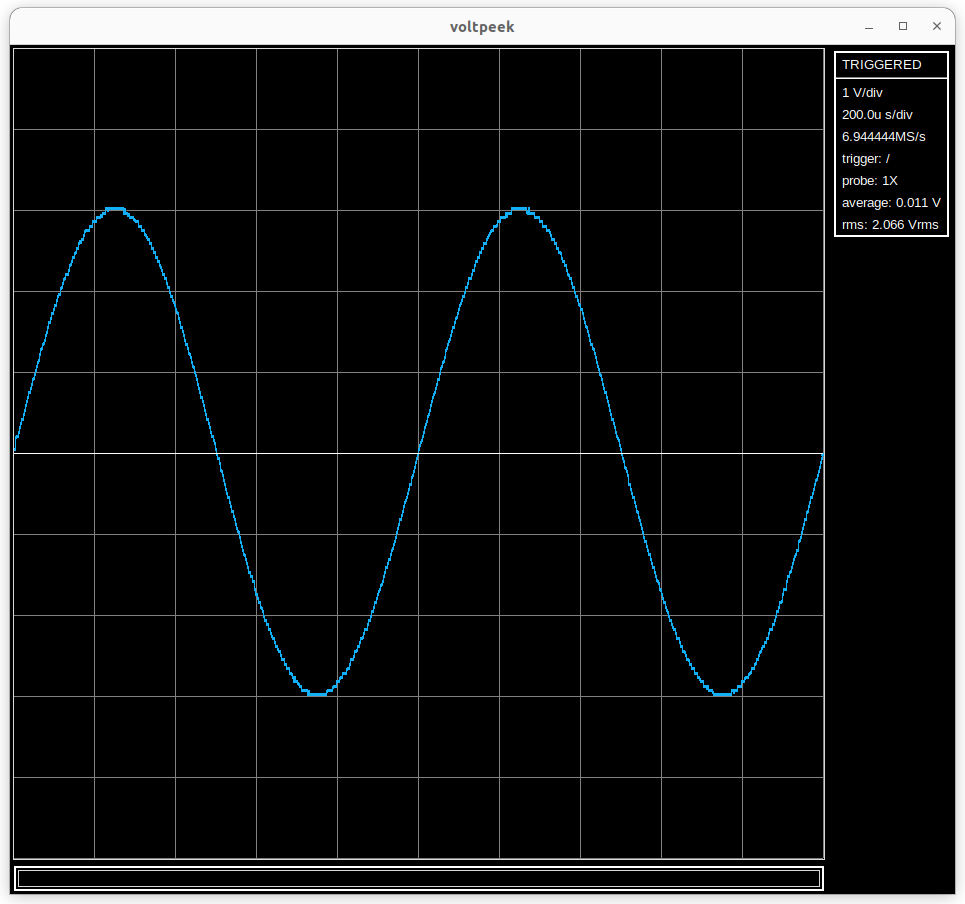

<h2> Voltpeek </h2>

Voltpeek is a command based PC oscilloscope software that is still in early development. Voltpeek works
with the Newtscope headless oscilloscope hardware which is also still in early development.

<h3> Command Based </h3>

By command based, we mean that everything in Voltpeek is controlled and adjusted via command instead of
click and drag or text entry, like many other oscilloscope softwares that run on PC. For example, the
scale command will put the oscilloscope/software in adjustment mode. The horizontal and vertical
scales can then be adjusted using the h, j, k, and l keys. Ctrl-C or esc will put the software back into 
command mode. As may be obvious, this is inspired by the vim text editor. 

<h3>Minimum Features to Integrate with Hardware:</h3>

- Rising and Falling Edge Triggers
- Single Shot Trigger
- Horizontal and Vertical Adjustment
- Serial Mode
- Select Newtscope Device and Connect
- Python API
